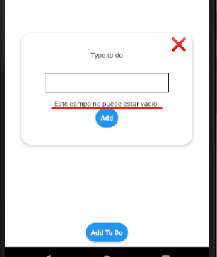

# Documentacion APP

## Table of Contents
1. [General Info](#general-info)
2. [Requisitos Previos](#requisitos-previos)
3. [Configuracion Inicial](#configuración-inicial)
4. [Ejecutar la aplicacion](#ejecutar-la-aplicación)
5. [Descarga APK Android](#descarga-apk-android)
6. [Uso de la aplicacion](#uso-de-la-aplicación)
#

## **General Info**

Esta es una aplicación Android desarrollada con **Expo** y **Yarn** que te permite crear y administrar una **lista de tareas**. Puedes agregar nuevas tareas utilizando un botón llamado "Add Todo", el cual abre un modal donde puedes ingresar el texto de la tarea que deseas realizar.


Al presionar el botón "Add" en el modal, la tarea se agregará a la lista de tareas. Si el campo de texto está vacío, el botón "Add" del modal no funcionará y se mostrará un mensaje debajo del campo de texto que dice "Este campo está vacío".


#

## **Requisitos Previos**

- **Node.js:** Asegúrate de tener Node.js instalado en tu sistema. Puedes descargarlo desde https://nodejs.org.

- **Yarn:** Asegúrate de tener Yarn instalado en tu sistema. Puedes encontrar instrucciones de instalación en https://yarnpkg.com.
#

## **Configuración Inicial**

1. Clona o descarga este repositorio.

2. Navega hasta el directorio del proyecto en tu terminal.

3. Ejecuta el siguiente comando para instalar las dependencias necesarias:

```
yarn install
````
#

## **Ejecutar la aplicación**

1. Después de completar la configuración inicial, ejecuta el siguiente comando para iniciar la aplicación:

<!-- Copy code -->
```
yarn start
```
1. Esto abrirá Expo Developer Tools en tu navegador.

2. Escanea el código QR que aparece en Expo Developer Tools utilizando la aplicación Expo en tu dispositivo Android. Asegúrate de que tu dispositivo y la máquina de desarrollo estén en la misma red.

3. Una vez escaneado, la aplicación se instalará y se abrirá en tu dispositivo Android.
#

## **Descarga APK Android**

1. Tambien se puede descargar la **APK** en el siguiente enlace: 
[TODO LIST APK](https://expo.dev/artifacts/eas/uxbkSfAoh9cTRkRVd6WxcA.apk)

**NOTA:** Para que la instalacion de la AKP en **dispositivo android** sea efectiva, se deben **desactivar la seguridad** en los permisos de intalacion de la **Play Strore** y asi mismo **activar permisos** en las notificaciones de la AKP una vez instalada. Una vez instalada la AKP **vuelva a activar** los permisos antes desactivados.

Aqui les dejo un link de una guia para desactivar estos permisos: [Guia para desactivar permisos de instalacion en la Play Store](https://www.youtube.com/watch?v=pnIRwivrmmA&ab_channel=ElandroidHD)

#


## **Uso de la aplicación**
- Al abrir la aplicación, verás una lista de tareas existentes (si las hay).


- Para agregar una nueva tarea, haz clic en el botón "Add Todo".

- Se abrirá un modal donde puedes ingresar el texto de la tarea que deseas realizar.

- Si el campo de texto está vacío, el botón "Add" del modal no funcionará y se mostrará un mensaje debajo del campo de texto que dice "Este campo está vacío".


- Al agregar la tarea a la lista de tareas, se mostrará en la lista junto con un temporizador de 5 minutos.

- Cada tarea en la lista también cuenta con un botón en forma de "X" para eliminar la tarea de la lista.


- Si el temporizador alcanza los 5 minutos, se generará una notificación push que indica que se ha agotado el tiempo para realizar dicha tarea. Esto se realiza utilizando la dependencia "expo-notification".


- La aplicación cuenta con persistencia de datos utilizando la dependencia "AsyncStorage". Esto significa que la lista de tareas se mantendrá incluso si cierras la aplicación. Los datos se almacenarán localmente en el dispositivo.


¡Disfruta usando la aplicación de Lista de Tareas! Si tienes alguna pregunta o problema, no dudes en consultar la documentación de Expo o [contactar al desarrollador](https://www.linkedin.com/in/cristian-pineda17/).
